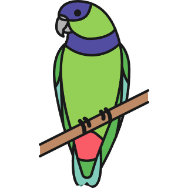

# Vidext - Prueba Técnica
## Editor es una aplicación que utiliza la biblioteca de Tldraw. El proyecto integra varias tecnologías modernas, incluyendo Nextjs, TailwindCSS, Shadcn y tRPC. La aplicación muestra operaciones básicas con un enfoque en la integración con Tldraw y la actualización de datos.

## Instalación
### 1 - Clona el Repositorio
https://github.com/CristianMozetich/vidext.git
### 2 - Instala las Dependencias
#### cd client
#### npm install
### 3 - Ejecuta el servidor de Desarrollo
#### npm run dev

## Puebas
### Ejecuta las pruebas de los endpoints realizadas con Jest
#### npm test

## Detalles de los componentes
### Editor Tldraw
#### Este componente permite realizar todas las funciones de Tldraw y además cuenta con un boton integrado que facilita el almacenamiento y la modificación de los shapes.
### Lista de Tareas
#### La aplicación cuenta con un formulario que permite crear una lista de tareas.
### Componentes Adicionales
#### La aplicación cuenta con una simple Sidebar de navegación que se adapta a diseños responsive.

## Tecnologías

